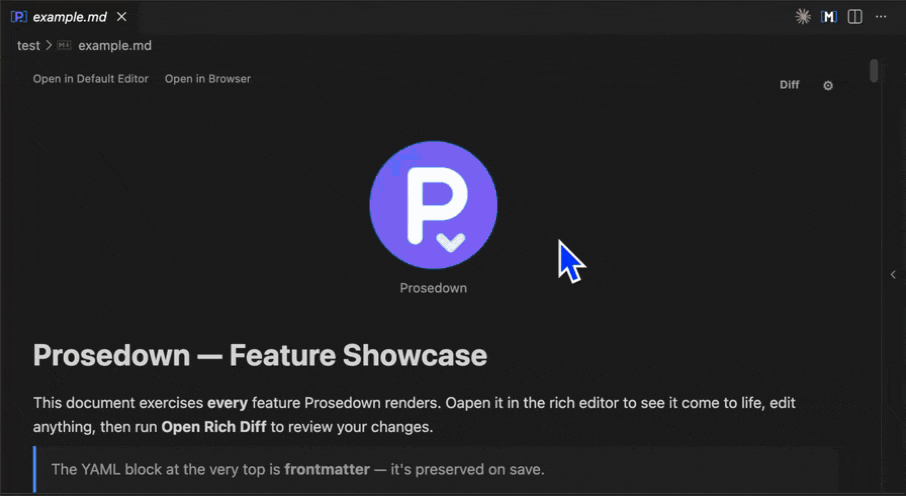
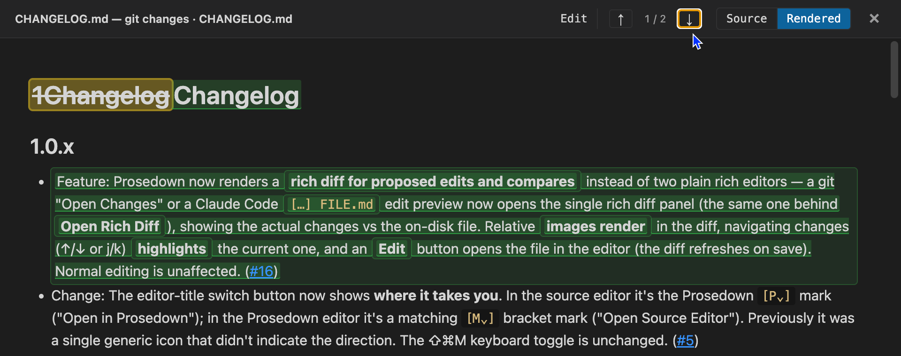

I read as much `.md` as all other programming languages combined.

Personal notes, research notes, Claude Code generated reports, random READMEs.

I find it easier to read rich, block-based markdown than raw markdown — WYSIWYG (What You See Is What You Get), so the document on screen already looks the way it will read.



That's why Prosedown exists.

## The Cool Stuff

### Rich Diffs — for git _and_ AI edits

You have seen rich editing. But have you seen rich **diffing**?

Prosedown renders a navigable, side-by-side diff of your markdown — with images inline and headings intact. It works for `git` changes **and** for AI-proposed edits: when Claude Code (or another agent) previews a change to a `.md` file, Prosedown opens the rich diff automatically. Step through every change with the ↑ / ↓ controls.



### Seamless Sync.

Open in the Default Editor.

Open in the Rich Editor.

Open in the Browser.

It just works.


### Navigate without hassle.

Sticky headings so you can navigate long documents with ease.

Table of contents so you know where you are.

Clicky here, go there.


## Loaded With Features

### Modes

#### Default Editor

Default editor supports opening in Rich Editor and Browser modes.

Enjoy it because this will be the last time you open the vanilla view.


#### Rich Editor

The rich editor lets you jump straight back to the default editor, or open in the browser. Everything syncs automatically and instantly.


#### Browser

Browser mode lets you open the rich editor as a Chrome/Firefox tab, so you can take it with you everywhere your browser goes.

Drag and drop images, gifs, etc.

It's like Notion, but you own the data.


### Rich editing

#### Slash Commands

The beloved `/` works out of the box. It's like you never left your favourite editor.


#### Checkboxes, Tables, Math, Quotes, Code Blocks, and your standard stuff.

Tables have options to:

- add row above, add row below
- add column to the left, add columns to the right
- remove rows, remove columns
- drop the entire table

You can write math using $\KaTeX$ in both inline and block modes.


#### Mermaid Diagrams

` ```mermaid ` fences render as live diagrams inline — edit the source, the preview updates.


#### YouTube & GitHub Embeds

Paste a YouTube or GitHub URL and get a rich card; the source stays a bare URL so the file remains portable.


## Known Limitations

- Conversion from markdown to rich text and back to markdown is not one-to-one exact map. The markdown after is normalized. You can control this to some extent via the settings icon in the rich editor mode.
- Bold/italic adjacent to a word, when the run also contains a code span, can't be expressed in plain CommonMark (e.g. `**`bold`**Apples` parses as literal asterisks, not bold). The editor saves these as `**`bold`**<!---->Apples` — an empty HTML comment is the cleanest CommonMark-valid way to break the flanking run so the bold survives re-open. Adding a space (or any non-word char) avoids the separator entirely and is handled naturally.

---

## Meta Thingies

### Installation

Hit the Install button on the marketplace page. No login, setup or permissions required. It works out of the box.

### Commands

Every action is in the command palette under the `Prosedown:` prefix.

| Command palette title          | Shortcut                                      | What it does                                                                                                                                                      |
| ------------------------------ | --------------------------------------------- | ----------------------------------------------------------------------------------------------------------------------------------------------------------------- |
| Toggle Prosedown/Source Editor | Cmd/Ctrl+Shift+M (on `.md` files)             | Swap the active `.md` between the Prosedown rich editor and VS Code's default text editor.                                                                        |
| Find in Document               | Cmd/Ctrl+F (inside the rich editor)           | Open the in-editor search bar for the current rich-editor pane.                                                                                                   |
| Open Rich Diff                 | Right-click an SCM entry, or the diff toolbar | Open a side-by-side or rendered markdown diff of the selected file vs HEAD (or any two URIs). AI-proposed edits open this automatically.                          |
| Open in Browser                | —                                             | Spin up a local server and open the file in your default browser as the same rich editor — drag-and-drop images, leave it open as a tab, edits sync back to disk. |
| Factory Reset Settings         | —                                             | Wipe all Prosedown settings back to defaults and re-show the welcome modal on the next file open. Confirms before applying.                                       |

### Keyboard shortcuts

| Shortcut         | Action                                  |
| ---------------- | --------------------------------------- |
| Cmd/Ctrl+Shift+M | Toggle rich / source editor             |
| Cmd/Ctrl+F       | Find in document                        |
| /                | Open slash command menu (start of line) |

### Privacy

I do not collect telemetry, analytics, or usage data.

I am too lazy to implement that.

Everything runs locally in your VS Code instance.

### Bugs/Feature Requests

If you encounter any bugs or have any feature requests, please [open an issue](https://github.com/psuzzi/prosedown/issues).

I am actively using it myself, so expect frequent updates.

### Available Platforms

VS Code: https://marketplace.visualstudio.com/items?itemName=psuzzi.prosedown

Open VSX: https://open-vsx.org/extension/psuzzi/prosedown

### Acknowledgments

Prosedown is a fork of the excellent [Markdown Studio](https://github.com/chaudhary1337/markdown-studio) by Tanishq Chaudhary, used under the MIT License. After contributing a few fixes upstream and seeing no further activity there, I decided to fork and continue development at full speed on a derived solution. My thanks to the original author for the foundation this builds on.
