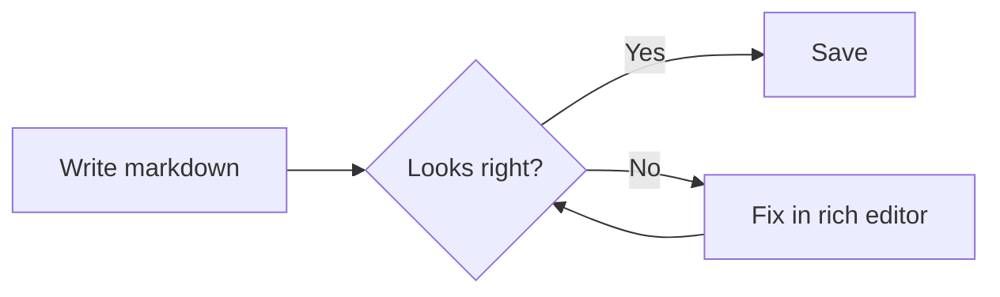
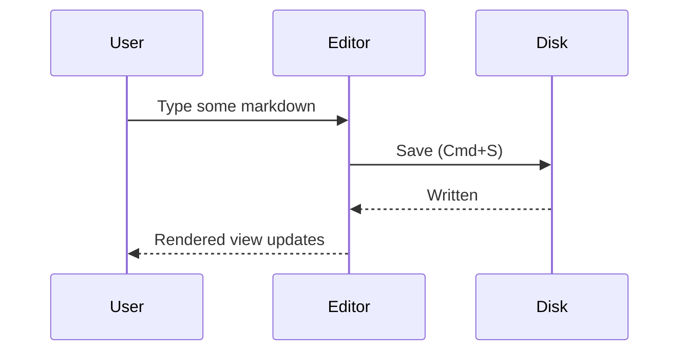
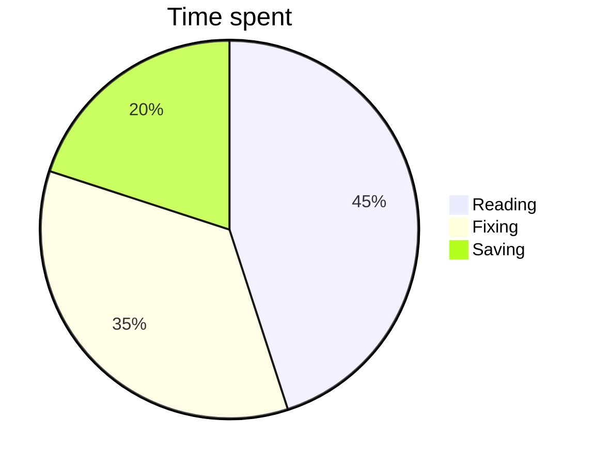
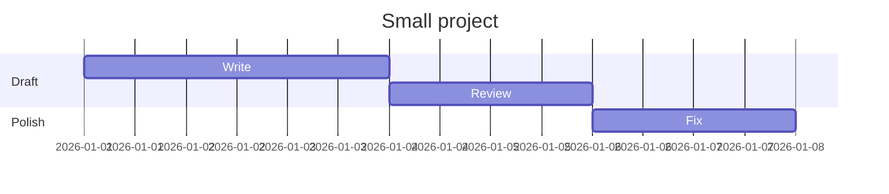

# Markdown Studio — Feature Showcase

This document exercises **every** feature Markdown Studio renders. Open it in the rich editor to see it come to life, edit anything, then run **Open Rich Diff** to review your changes.

> The YAML block at the very top is **frontmatter** — it's preserved on save.

---

## 1. Headings

# Heading 1

## Heading 2

### Heading 3

#### Heading 4

##### Heading 5

###### Heading 6

## 2. Inline text formatting

**Bold**, _italic_, **_bold italic_**, ~~strikethrough~~, and `inline code`.

Combine them: **bold with `code`**, _italic <!---->_[_link_](https://example.com).

Links: [labelled link](https://www.anthropic.com) and a bare autolink https://www.anthropic.com

## 3. Blockquotes

> A single blockquote.
>
> > Blockquotes can nest,
> >
> > > and nest again.

## 4. Lists

**Unordered**

- First item
- Second item
  - Nested item
    - Deeper still
- Third item

**Ordered**

1. Step one
2. Step two
   1. Sub-step
   2. Sub-step
3. Step three

**Task list** (checkboxes are clickable in the rich editor)

- [x] Read the document
- [ ] Edit a paragraph
- [ ] Save with Cmd+S

## 5. Tables (with alignment)

| Left aligned | Centered | Right aligned |
| ------------ | -------- | ------------- |
| apple        | red      | 1.00          |
| banana       | yellow   | 0.50          |
| cherry       | dark     | 3.25          |

A cell can contain `code`, **bold**, and even a pipe: `a\|b`.

## 6. Code blocks

TypeScript:

```ts
function greet(name: string): string {
  return `Hello, ${name}!`;
}
console.log(greet("world"));
```

Python:

```python
def fib(n):
    a, b = 0, 1
    for _ in range(n):
        a, b = b, a + b
    return a
```

Bash:

```bash
#!/usr/bin/env bash
for f in *.md; do
  echo "Processing $f"
done
```

JSON:

```json
{
  "name": "markdown-studio",
  "features": ["math", "mermaid", "tables"],
  "enabled": true
}
```

## 7. Math (LaTeX via KaTeX)

Inline: the area of a circle is $A = \pi r^2$, and Euler's identity is $e^{i\pi} + 1 = 0$.

Block equations:

$$
\int_{-\infty}^{\infty} e^{-x^2}\,dx = \sqrt{\pi}
$$

$$
\sum_{k=1}^{n} k = \frac{n(n+1)}{2}
\qquad
\frac{d}{dx}\left( \frac{1}{x} \right) = -\frac{1}{x^2}
$$

A matrix:

$$
A = \begin{bmatrix}
1 & 2 & 3 \\
4 & 5 & 6 \\
7 & 8 & 9
\end{bmatrix}
$$

Greek and symbols: $\alpha, \beta, \gamma, \Delta, \nabla, \forall, \exists, \in, \leq, \geq, \approx$.

## 8. Diagrams (Mermaid)

**Flowchart**



**Sequence diagram**



**Pie chart**



**Gantt**



## 9. Images

Remote image:


> You can also **paste** an image from the clipboard or **drag-and-drop** a file straight into the editor — it's copied next to the document and linked automatically.

## 10. Embeds (bare URL on its own line)

**YouTube** — becomes a playable card:

https://www.youtube.com/watch?v=dQw4w9WgXcQ

**GitHub repository:**

https://github.com/chaudhary1337/markdown-studio

**GitHub pull request:**

https://github.com/chaudhary1337/markdown-studio/pull/14

## 11. Horizontal rules & special characters

Above a rule.

---

Below the rule. Escaped characters render literally: \*not italic\*, \_not italic\_, and a literal backtick \` .

---

_That's the full tour — edit anything above and watch it update live._
